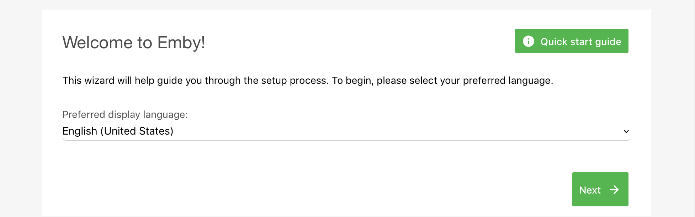
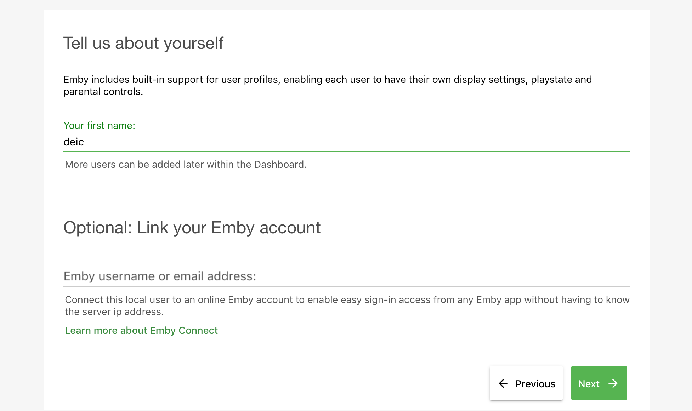
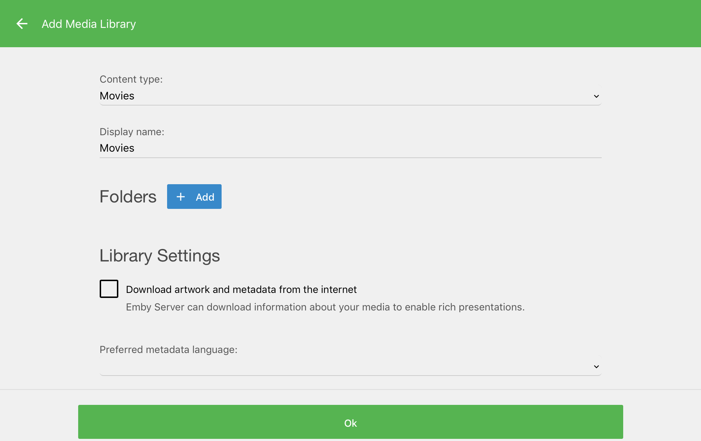
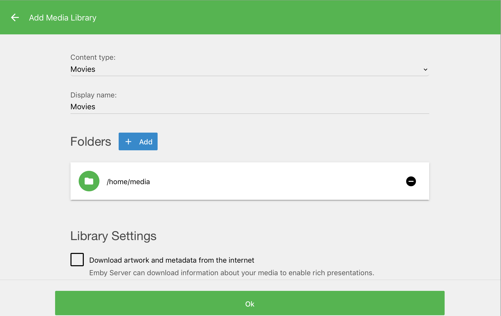
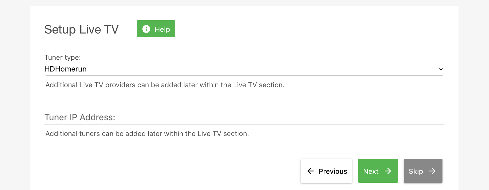
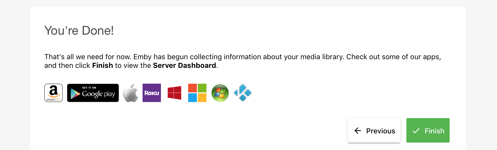
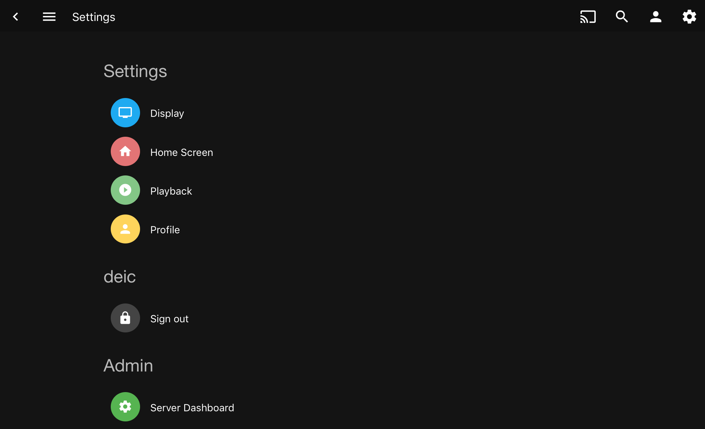
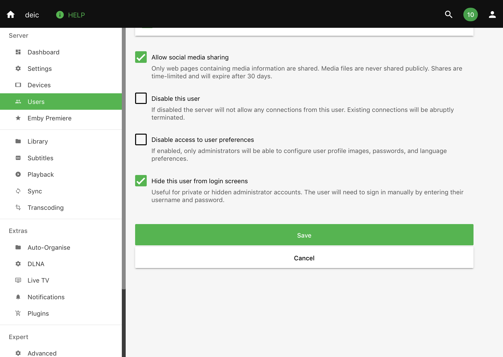
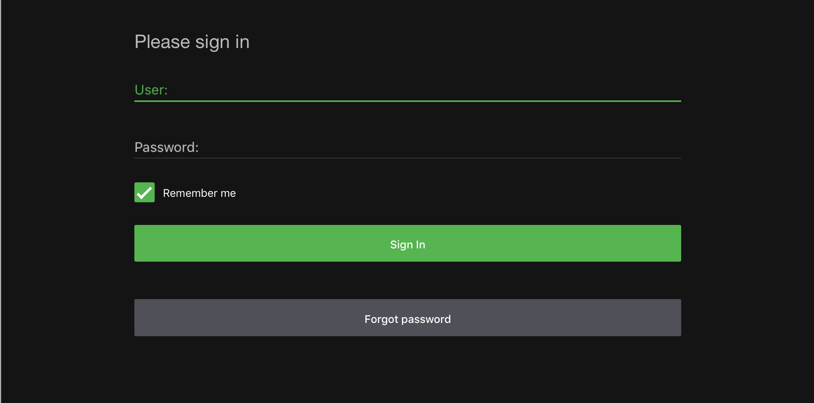

# Installation of the target web-server

The _target web-server_ is based on Ubuntu 14.04.5 LTS, has a public IP address
and runs both a SSH and HTTP service. Both services are protected by a local IP
firewall and an application firewall. As looking at a static html page may
not be that sexy we have installed an _emby media server_ capable of serving
4 different movies: two analog clocks (with sound), _Seven red lines_ from
Youtube and a seven second movie of a cartoon rabbit coming out of a hole.

The pre-requisite is Ubuntu 14.04.5 LTS with an ssh server installed.

The server does not enforce SSL as this is outside the scope of this context.
Digital ocean has written an excellent article on 
[how to secure NGINX with let's encrypt on ubuntu 14-04](https://www.digitalocean.com/community/tutorials/how-to-secure-nginx-with-let-s-encrypt-on-ubuntu-14-04). There is an excelent boiler template for [nginx.config here](https://gist.github.com/plentz/6737338).

Our server has the public IP address 130.226.136.242

## How to Install the media server emby on top of NGINX

This is a documented procedure for the installation of **emby** a media streaming
server used as a target for the DEiC Distributed Denial of Service Project. The
media server hosts a number of interesting videos, among one 12 hour long video of
a analog clock with hands. The purpose of the installation is to demonstrate a
service under attack.

Notice that the following commands require root privileges.

Start by installing an Ubuntu 14.01 LTS server with an SSH daemon. Reboot
and install patches:

	apt-get -y update
	apt-get -y dist-upgrade

Reboot if required.

Install the local developed packages from SSI:

  - ``cmod_1.1-2.deb``: modules (not essential)
  - ``dailybuandupdate_1.6-1.deb``: automated patch and backup. Patches are installed on a daily basis, the host reboots if required. 
  - ``grouproot_1.2-1.deb``: shared administrator environment (not essential)

Next install [NGINX](https://en.wikipedia.org/wiki/Nginx):

	apt-get -y install nginx

Then install the [emby](https://en.wikipedia.org/wiki/Emby) media server:

	apt-key adv --keyserver keyserver.ubuntu.com --recv-keys  0A506F712A7D8A28

	echo 'deb http://download.opensuse.org/repositories/home:/emby/xUbuntu_14.04/ /' \
		> /etc/apt/sources.list.d/emby-server.list
	apt-get -y update
	apt-get -y install emby-server

You may have to start it manually:

	service emby-server start

The emby server is now running on TCP port 8096.

Next configure NGINX to proxy port 80 to port 8096:

	test -f /etc/nginx/sites-available/default.org || {
		/bin/cp -v	/etc/nginx/sites-available/default	\
				/etc/nginx/sites-available/default.org
	}

	cat << 'EOF' > /etc/nginx/sites-available/default
	#
	# emby as default server
	#
	server {
		listen 80 default_server;
		listen [::]:80 default_server ipv6only=on;

		root /usr/share/nginx/html;
		index index.html index.htm;

		# Make site accessible from http://localhost/
		server_name localhost;

		location / {
			proxy_pass http://127.0.0.1:8096;
		}
	}
	# HTTPS server
	#
	#server {
	#	listen 443;
	#	server_name localhost;
	#
	#	root html;
	#	index index.html index.htm;
	#
	#	ssl on;
	#	ssl_certificate cert.pem;
	#	ssl_certificate_key cert.key;
	#
	#	ssl_session_timeout 5m;
	#
	#	ssl_protocols SSLv3 TLSv1 TLSv1.1 TLSv1.2;
	#	ssl_ciphers "HIGH:!aNULL:!MD5 or HIGH:!aNULL:!MD5:!3DES";
	#	ssl_prefer_server_ciphers on;
	#
	#	location / {
	#		proxy_pass http://127.0.0.1:8096;
	#	}
	#}
	EOF

Then reload the nginx configuration:

	nginx -s reload

The emby server is now running on TCP port 80.

## Local host security

The server has to be secured. As everything has been installed as packages and all
patches will be applied on a daily basis we just need to apply general IP address 
filtering and brute force login mitigation. The installation and configuration of
a host-based intrusion detection system is outside the scope of this document. See
e.g. [OSSEC](https://en.wikipedia.org/wiki/OSSEC).

### IP filtering

Enable the build in [ufw](https://en.wikipedia.org/wiki/Uncomplicated_Firewall) 
IP firewall - the commands may block your access:

	ufw enable
	ufw default deny incoming
	ufw default allow outgoing

Then open for _forskningsnet_ addresses:

	for CIDR in 95.128.24.0/21 130.225.0.0/16 130.226.0.0/16 192.38.0.0/17 185.1.57.0/24
	do
		ufw allow from ${CIDR}  to any port 22
		ufw allow from ${CIDR}  to any port 80
		ufw allow from ${CIDR}  to any port 443
	done

And check the rules has been enabled:

	ufw status numbered

A comprehensive introduction to _ufw rules_ on Ubuntu 14 is available at 
[digitalocean](https://www.digitalocean.com/community/tutorials/how-to-set-up-a-firewall-with-ufw-on-ubuntu-14-04).

### Application firewall

While the _ufw_ rules limits access to _forskningsnet addresses_, it doesn't
prevent brute force attacks.

[fail2ban](https://en.wikipedia.org/wiki/Fail2ban) is an intrusion prevention
software framework that protects computer servers from brute-force attacks.
Written in the Python programming language, it is able to run on POSIX systems
that have an interface to a packet-control system or firewall installed
locally, for example, iptables or TCP Wrapper. It may be installed with:

	apt-get -y install fail2ban

And an configuration for the emby media server added with:

	cat << EOF > /etc/fail2ban/filter.d/emby.conf
	# Fail2Ban filter for emby

	[INCLUDES]

	# Read common prefixes. If any customizations available -- read them from
	# common.local
	before = common.conf

	[Definition]

	_daemon = emby-server

	failregex = Info HttpServer: HTTP Response 401 to <HOST>.*authenticatebyname
	            Info HttpServer: HTTP Response 500 to <HOST>.*mediabrowser/Users/None

	ignoreregex =

	# Invalid username or password entered
	# DEV Notes:
	#
	#  Matching on http 401 with a trailing url including 'authenticatebyname' to catch incorrect passwords
	#  Matching on http 500 with a trailing url including 'mediabrowser/Users/None' to catch incorrect usernames
	#
	# From: https://emby.media/community/index.php?/topic/31362-fail2ban-custom-emby-filter/
	EOF

The configuration is enabled by adding a section to ``/etc/fail2ban/jail.local`` which
may or may not exist already.

	test -f /etc/fail2ban/jail.local.org || {
		/bin/cp /etc/fail2ban/jail.local /etc/fail2ban/jail.local.org
	}
	touch /etc/fail2ban/jail.local.org

	(
		cat /etc/fail2ban/jail.local.org > /etc/fail2ban/jail.local
	cat << EOF >> /etc/fail2ban/jail.local
	[emby]
	enabled  = true
	port     = 8096
	filter   = emby
	logpath  = /var/lib/emby-server/logs/server-*.txt
	maxretry = 2
	EOF
	)

Finally the service has to be reloaded:

	service fai2ban reload

## Emby configuration

The configuration is done through the Web-UI, but requires data to be
added in advance.

### Data - lots of clocks but no cats

mkdir -p /home/media/Movies

Upload relevant information from /lan/ssi/shared/docs/emby-test-data

### Configuration

The goal is to have one user - deic - and manual login with username and password on the main web page and no anonymous data collection. The Web-UI configuration is done this way; select language

That should be it, we now have a media server suitable for target testing.

-------
[cover page generator](https://dev.to/rly)

